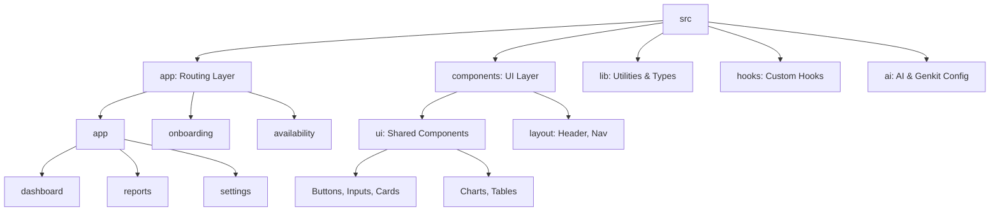

# SCON(Shift CONtrol)- SaaS형 직원 근무표 관리 서비스

# 🥐 SCON (Shift Control)

> **스콘처럼 쉽고 간편하게 만드는 스마트 근무표, SCON**

**SCON**은 '**S**hift **Con**trol'의 약자로, 베이커리 카페의 복잡한 아르바이트 교대 근무표를 효율적으로 관리하기 위한 SaaS 프로젝트입니다.

## 1. 주요 기능

* **대시보드 (Dashboard)**:
  * 오늘의 근무자, 승인 대기 요청, 이번 달 예상 인건비 등 핵심 지표를 한눈에 파악할 수 있는 요약 카드 제공
  * 주간/월간 스케줄 캘린더 뷰
* **일정 관리 (Schedule Management)**:
  * 직관적인 드래그 앤 드롭 인터페이스 (구현 예정)
  * 직원별 가용 시간 확인 및 일정 충돌 방지
  * 근무 교체/변경 요청 및 관리자 승인 프로세스
* **보고서 (Reports)**:
  * 직원별 근무 시간 및 급여 계산 테이블
  * 기간별 운영 비용 리포트 생성
* **온보딩 (Onboarding)**:
  * 신규 매장 설정을 위한 단계별 위자드 (계정 생성 -> 매장 정보 -> 직원 등록)
  * 직원 초대 및 기본 정보 설정
* **AI 통합 (Genkit)**:
  * Google Genkit 기반 AI 어시스턴트 연동 준비
  * 향후 AI 자동 스케줄링 및 운영 최적화 제안 기능 탑재 예정

## 2. 기술 스택

* **Frontend Framework**: Next.js 15 (App Router)
* **Language**: TypeScript
* **Styling**: Tailwind CSS, tailwind-merge, clsx
* **UI Library**: Radix UI (Headless UI), Shadcn UI (Component Pattern)
* **Icons**: Lucide React
* **Charts**: Recharts
* **Form & Validation**: React Hook Form, Zod
* **Backend & Auth**: Firebase v11 (Authentication, Firestore)
* **AI SDK**: Google Genkit
* **State Management**: React Context API (Global), React Hooks (Local)

## 3. 설치 및 실행

### 필수 요구사항

* Node.js v18 이상
* npm 또는 yarn/pnpm 패키지 매니저

### 설치 단계

1. 프로젝트 클론 및 이동:

   ```bash
   git clone --recursive https://github.com/beyondnr/BA-to-SW-Dev.git
   cd Frontend/firebase-shift-roster
   ```
2. 의존성 패키지 설치:

   ```bash
   npm install
   ```
3. 환경 변수 설정:

   * 루트 디렉토리에 `.env.local` 파일 생성
   * 필요한 API 키 입력 (예: Google GenAI, Firebase Config)

   ```env
   GOOGLE_GENAI_API_KEY=your_api_key_here
   ```

### 실행 방법

* **개발 서버 실행**:

  ```bash
  npm run dev
  ```

  브라우저에서 `http://localhost:9002` 접속
* **Genkit 개발 도구 실행**:

  ```bash
  npm run genkit:dev
  ```

## 4. 프로젝트 구조



* **`src/app`**: Next.js App Router 기반의 페이지 라우팅 구조
* **`src/components`**: 재사용 가능한 UI 컴포넌트 (Atomic Design 패턴 지향)
* **`src/lib`**: 공통 유틸리티 함수, 타입 정의, Mock 데이터 관리
* **`src/ai`**: Google Genkit 설정 및 AI 모델 로직

## 5. 디자인 시스템

* **Typography**:
  * **Headline**: `PT Sans` - 전문적이고 가독성 높은 헤드라인
  * **Body**: `Inter` - 깔끔하고 현대적인 본문 폰트
* **Color Palette**:
  * **Primary**: 잘 구워진 스콘의 겉면 색 (#C68E5E) - 따뜻하고 신뢰감 있는 메인 컬러
  * **Secondary**: 라떼 폼 같은 부드러운 베이지 (#EAE0D5) - 보조 및 배경 요소
  * **Accent**: 차분한 벽돌색 (#D9534F) - 강조 및 알림
  * **Background**: 눈이 편안한 크림색 (#F9F7F2)
  * **Text**: 가독성을 고려한 에스프레소 색 (#3E3B36)
* **Components**:
  * Shadcn UI 기반의 일관된 컴포넌트 디자인
  * 접근성(Accessibility)이 고려된 Radix UI Primitives 사용

## 6. 데이터 흐름

1. **User Interaction**: 사용자가 UI(Form, Button)를 통해 액션 수행
2. **State Update**:
   * Local State: `useState`, `useReducer`
   * Form State: `React Hook Form`
   * Global Context: `OnboardingContext` (설정 단계 데이터 유지)
3. **Data Validation**: `Zod` 스키마를 이용한 엄격한 데이터 검증
4. **API/Service Layer**:
   * 현재: `mock-data.ts`를 통한 더미 데이터 처리
   * 향후: Firebase SDK를 통한 Firestore 실시간 동기화
5. **UI Rendering**: 변경된 상태를 React 컴포넌트에 반영 및 Re-render

## 7. 핵심 UX 특징

* **Dashboard First**: 접속 직후 가장 중요한 업무(승인, 인건비 확인)를 처리할 수 있도록 대시보드 중심 설계
* **Step-by-Step Wizard**: 복잡한 초기 설정을 단계별로 나누어 사용자의 심리적 부담을 줄이고 이탈률 방지
* **Real-time Feedback**: 저장, 삭제, 오류 등의 상태를 Toast 메시지로 즉각적인 피드백 제공
* **Responsive**: 데스크탑, 태블릿, 모바일 등 다양한 기기 환경에 최적화된 레이아웃 제공

## 8. 주요 흐름

### 1) 초기 설정 (Onboarding Flow)

1. **계정 생성**: 이메일 및 비밀번호 설정
2. **매장 정보 입력**: 매장명, 업종, 운영 시간 설정
3. **직원 등록**: 초기 직원 명단 및 시급 정보 입력 -> 설정 완료 후 대시보드 이동

### 2) 근무 일정 승인 (Approval Flow)

1. **요청 확인**: 대시보드 내 '승인 대기' 카드 확인
2. **상세 검토**: 모달 창을 통해 요청 사유 및 시간 확인
3. **의사 결정**: 승인 또는 거절 버튼 클릭 -> 상태 업데이트 및 근무표 반영

## 9. 향후 개선 사항

* **Backend Integration**: Firebase Auth 및 Firestore 연동으로 실제 데이터 영구 저장 구현
* **AI Scheduling**: 직원 선호도와 매장 운영 시간을 고려한 AI 기반 자동 스케줄링 기능 개발
* **Mobile App**: PWA 또는 React Native를 활용한 모바일 전용 앱 확장
* **Notification**: 이메일 및 푸시 알림 서비스 연동 (근무 변경, 공지사항 등)
